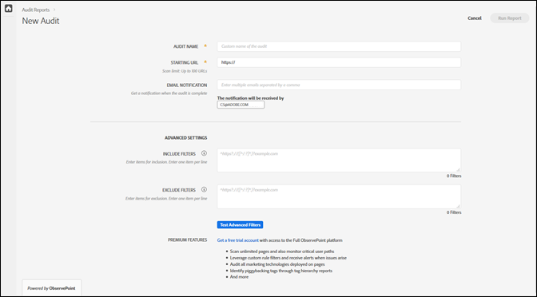

# 建立新的稽核{#create-a-new-audit}

>[!NOTE]
>
>使用者一次只能執行一項稽核。如果您嘗試執行的稽核使用與執行中的稽核相同的設定，則會發生錯誤。若要取消目前執行的稽核以建立新的稽核，您可以使用錯誤訊息中的連結。

如有需要，請使用頁面底部的連結，存取 ObservePoint 免費且功能完整的試用帳戶。

1. 在 Auditor 清單中，按一下&#x200B;**[!UICONTROL 「新增稽核」]**。

   [!DNL New Audit] 畫面隨即開啟。

   

1. (必要) 為稽核命名。

   名稱的長度最多可為 250 個字元。
1. (必要) 指定起始 URL。

   指定起始 URL 時需要通訊協定。起始 URL 是稽核開始進行編目的頁面。Adobe Experience Platform Auditor 啟動後，會依循連結從起始 URL 開始對頁面進行編目，最多能編目 500 個頁面。如需詳細資訊，請參閱[包含和排除篩選器](../create-audit/filters.md)。起始 URL 的長度最多可為 250 個字元。

   >[!NOTE]
   >
   >在某些情況下，完成 500 個頁面的掃描可能需要 48 小時。

1. 指定一或多個電子郵件地址，用以取得此稽核的相關通知。

   您可用逗點分隔地址，以指定多個電子郵件。依預設會通知請求者。電子郵件地址會進行即時驗證。如果您輸入的地址無效，畫面上會顯示通知。

   每個電子郵件的長度限定為 250 個字元，包括網域結尾在內 (例如 .com)。

1. 指定[!UICONTROL 「包含篩選器」]。

   此欄位可包含確切的 URL、部分 URL 或規則運算式。請使用此欄位指定每個 URL 必須符合的標準。任何所編目的 URL 只要不符合[!UICONTROL 「包含篩選器」]標準，就不會納入稽核結果之中。

   您可以輸入要讓稽核掃描的目錄。或者，您可以執行跨網域或自我轉介稽核；此時您必須在一個網域上開始進行稽核，並在另一個網域上結束稽核。若要這麼做，請輸入您要周遊的網域；針對複雜的 URL 模式，請使用規則運算式。

   >[!NOTE]
   >
   >如果您在篩選器中加入某個頁面，但該頁面未與起始 URL 連結，或 Platform Auditor 在處理該頁面前已掃描了 500 個頁面，系統將不會掃描該頁面，也不會將其納入測試結果之中。

   包含篩選器限定為每行最多 1,000 個字元。

   如需詳細資訊，請參閱[包含篩選器](../create-audit/filters.md)。
1. 指定排除篩選器。

   [!UICONTROL 「排除清單」]可防止 URL 受到稽核。您可以使用確切的 URL、部分 URL 或規則運算式，就像在[!UICONTROL 「包含清單」]中操作一樣。

   如果稽核具有使用者工作階段 (例如 `/logout`，表示任何包含字串 `/logout` 的 URL)，常見的作法是排除登出連結。

   排除篩選器限定為每行最多 1,000 個字元。

   如需詳細資訊，請參閱[排除篩選器](../create-audit/filters.md)。
1. (選用) 如有需要，您可以測試包含和排除篩選器，並測試您的 URL。

   請輸入篩選器和 URL，然後按一下&#x200B;**[!UICONTROL 「套用」]**&#x200B;以執行測試。

   

1. 按一下&#x200B;**[!UICONTROL 「執行報表」]**。
