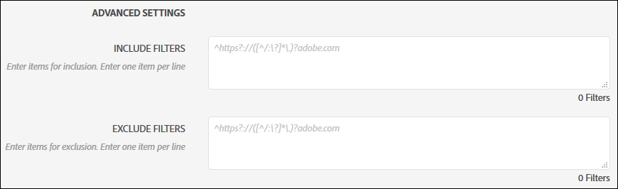
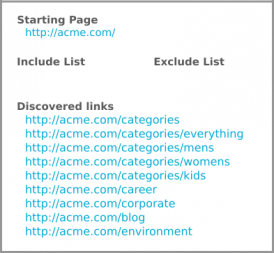
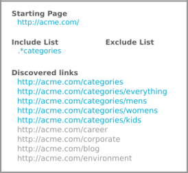
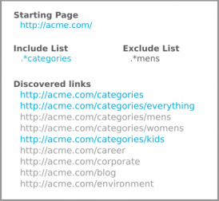
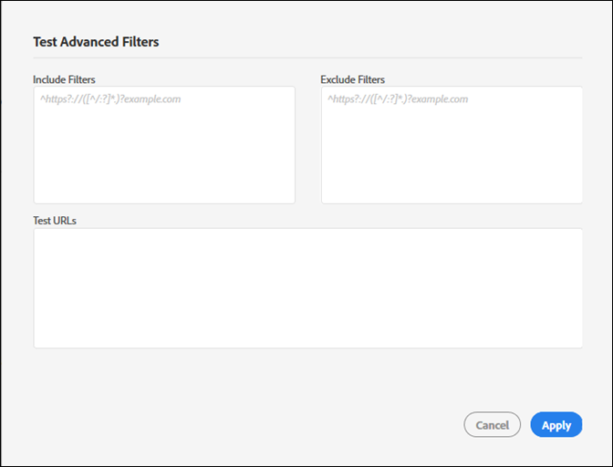

# 包含和排除篩選器{#include-and-exclude-filters}

包含篩選器會限制稽核可從起始 URL 開始進行編目的連結。排除篩選器會防止稽核對連結進行編目。

<!--
Content from ObservePoint (https://help.observepoint.com/articles/2872121-include-and-exclude-filters) with their permission. Modified slightly for style and Auditor emphasis.
-->

包含篩選器和排除篩選器可提供稽核的準則。將包含和排除篩選器保留為空白，可讓稽核對其辨識到的任何連結進行編目，從起始 URL 上的連結開始。



藉由套用包含篩選器、排除篩選器或兩者的組合，可針對稽核可編目的連結提供相關指示。

若[!UICONTROL 「包含篩選器」]欄位中有任何項目，系統將只會掃描符合該項目的頁面。若[!UICONTROL 「排除篩選器」]欄位中有任何項目，則系統不會掃描符合該項目的任何頁面。

包含和排除篩選器可以是完整 URL、部分 URL 或符合有效頁面的規則運算式。

## 優先順序{#section-e9d42419dd3f459bb20e7a33c6104f12}

1. **起始 URL** 優先於其他所有項目，且在稽核期間一律會被瀏覽，即使 URL 符合排除篩選器中的項目亦然。起始 URL 一律會比其他 URL 先被瀏覽。

   

   在上圖中，稽核從起始頁面的 `document.links` 屬性中探索到連結。這些連結符合由稽核掃描的條件。

1. **包含 URL** 必須從起始頁面連結，否則將無法探索到，也無法瀏覽。

   

   在上圖中，新增包含篩選器，會將符合條件的 URL 限定為符合篩選器的 URL。此時，只有五個連結符合由稽核掃描的條件。

1. **排除 URL** 會使連結不符合條件。

   

   在上圖中，新增排除篩選器，會使 URL 排除在符合條件的連結外。此時，只有三個連結符合由稽核掃描的條件。

## 起始 URL{#section-ccb46abcd96f4a8ab171245015d2b724}

使用 Adobe Experience Platform Auditor 時，起始 URL 必須為單一頁面。起始 URL 一律會比其他 URL 先被瀏覽。從起始頁面探索到的任何連結都符合瀏覽的條件，但須受到包含和排除篩選器的限制。如果排除項目符合起始 URL，該 URL 會被忽略。

## 包含篩選器{#section-7626060a56a24b658f8c05f031ac3f5f}

包含篩選器會限制在稽核期間符合掃描條件的連結。包含篩選器可以是：

* 完整 URL
* 部分 URL
* 符合完整或部分 URL 的規則運算式
* 上述項目的任何組合

將 URL 或規則運算式新增至包含篩選器，並不保證在稽核中一定會掃描這些 URL。稽核會檢查起始 URL 上的連結，然後導覽至符合條件的連結。稽核會持續進行此一檢查和導覽程序，直到達到掃描 500 個 URL 的限制，或直到找不到符合條件的連結為止。

>[!NOTE]
>
>在某些情況下，完成 500 個頁面的掃描可能需要 48 小時。

根據預設，稽核會掃描起始 URL 的所有子網域。除非藉由提供包含篩選器明確加以覆寫，否則掃描將使用下列 Regex 包含篩選器：

`^https?://([^/:\?]*\.)?mysite.com`

這會使任何位於起始 URL 頁面上的連結都符合瀏覽條件。它會符合起始 URL 中任何子網域上的任何頁面。

使用預設的包含篩選器，可讓稽核有較廣泛的編目範圍。若要著重在特定區段或頁面上，請在此方塊中新增篩選器，以對稽核提供特定指示。在此情況下，請將預設值取代為您要讓稽核掃描的目錄。您也可以使用「包含篩選器」來執行跨網域稽核，此時您開始稽核時所處的網域，必需與結束稽核時不同。若要這麼做，請輸入您要周遊的網域。無論如何，若要找到任何「包含篩選器」URL，必須在稽核的頁面上加以探索。

「包含篩選器」可包含確切的 URL、部分 URL 或規則運算式。例如，如果 [!DNL http://mysite.com] 是起始 URL，則下列頁面依預設將符合掃描的條件 (請注意粗體字元)：

```html
http://mysite.com
http
<b>s</b>://mysite.com
http://
<b>www</b>.mysite.com/home
http://
<b>dev</b>.mysite.com/home
http://
<b>my</b>.mysite.com/products/products_and_services.html
```

對於複雜的 URL 模式，請使用 [ObservePoint 的規則運算式測試器](https://regex.observepoint.com/)。

## 排除篩選器{#section-00aa5e10c878473b91ba0844bebe7ca9}

排除篩選器會防止 URL 進行稽核。您可以使用確切的 URL、部分 URL 或規則運算式。任何 URL 只要符合排除篩選器中的項目，即不會被瀏覽。如果您的起始 URL 包含在排除篩選器中，該 URL 並不會排除。稽核一律會掃描起始 URL。

## 測試篩選器和 URL{#section-3cfa125b1756411395a64701e128efa0}

您可以在 Platform Auditor 中測試篩選器和 URL。

在建立稽核時，按一下&#x200B;**[!UICONTROL 「測試進階篩選器」]**。輸入您的篩選器和 URL，然後按一下&#x200B;**[!UICONTROL 「套用」]**。



## ObservePoint 文件{#section-79cdc8e850d047969b6d2badf6bbd6f9}

本文是與 ObservePoint 共同撰寫。如需最新資訊，請參閱 [ObservePoint 文件](https://help.observepoint.com/)。
