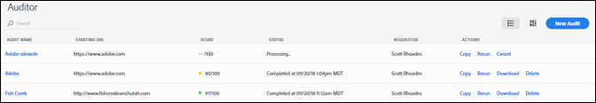
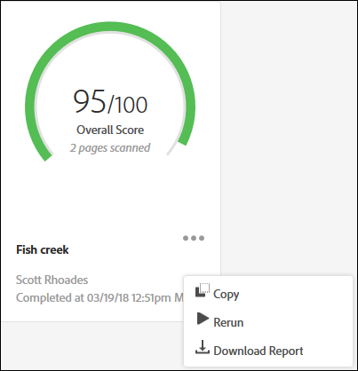

# 稽核清單頁面{#audit-list-page}

「稽核清單」頁面會顯示所有稽核的相關資訊。

啟動 Adobe Experience Platform Auditor 時，畫面會出現「稽核清單」頁面。您可以用清單或卡片視圖的形式來檢視「稽核清單」頁面。

## 清單視圖{#section-a428749d2ab94a08bf460e6a486b844a}

清單視圖會針對您的每個稽核顯示下列資訊。

| 項目 | 說明 |
|---|---|
| 稽核名稱 | 為稽核指定的名稱 |
| 起始 URL | 稽核作業開始對頁面編目的 URL |
| 分數 | 稽核分數介於 1 到 100 之間，其中 100 表示掃描的頁面沒有任何問題 |
| 狀態 | 顯示稽核作業於何時完成，或是正在處理中 |
| 請求者 | 顯示建立稽核作業的使用者名稱 |
| 動作 | 提供複製或重新執行稽核、取消目前執行的稽核、以 [!DNL Excel] 試算表格式下載報表，或刪除稽核的連結 |

按一下稽核的名稱即可查看稽核結果。

## 卡片視圖{#section-6826b585e53a46daa722b9bd3eda926e}

卡片視圖會以圖形格式顯示每個稽核。

按一下稽核的名稱即可查看稽核結果。按一下名稱旁的功能表即可查看各個連結，用以複製、重新執行或取消稽核，或以 [!DNL Excel] 試算表或 PDF 格式下載完成的報表。

