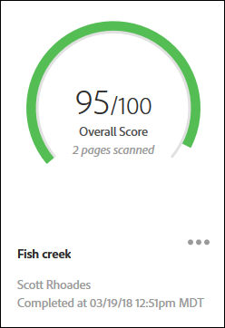

# 稽核清單頁面{#audit-list-page}

「稽核清單」頁面會顯示所有稽核的相關資訊。

當您啟動Adobe Experience Platform Auditor時，會出現「稽核清單」頁面。 您可以用清單或卡片視圖的形式來檢視「稽核清單」頁面。

## 清單視圖{#section-a428749d2ab94a08bf460e6a486b844a}

清單視圖會針對您的每個稽核顯示下列資訊。

| 項目 | 說明 |
|---|---|
| 稽核名稱 | 指定給審計的名稱 |
| 起始 URL | 審計開始搜索頁面的URL |
| 分數 | 稽核計分從1到100，計分100，這表示掃描的頁面上沒有問題 |
| 狀態 | 顯示審計何時完成或正在處理 |
| 請求者 | 顯示建立審計的用戶的名稱 |
| 動作 | Provides links for copying or rerunning the audit, canceling an audit that is currently running, downloading a report as an [!DNL Excel] spreadsheet, or deleting the audit |

按一下稽核的名稱即可查看稽核結果。

## 卡片視圖{#section-6826b585e53a46daa722b9bd3eda926e}

卡片視圖會以圖形格式顯示每個稽核。

按一下稽核的名稱即可查看稽核結果。Click the menu next to the name to see links for copying, rerunning, or canceling the audit, or to download a finished report as an [!DNL Excel] spreadsheet or PDF.

