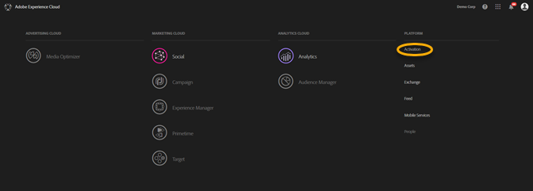
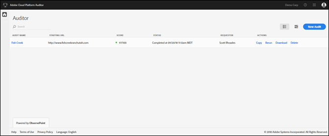
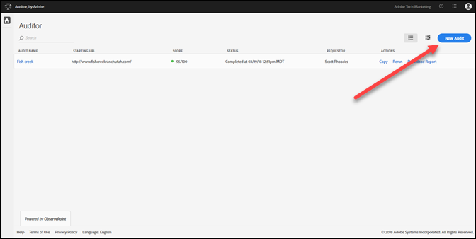
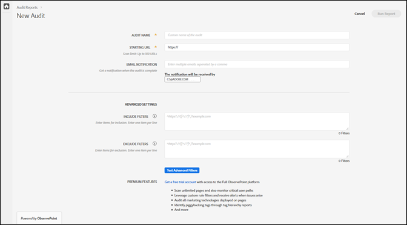
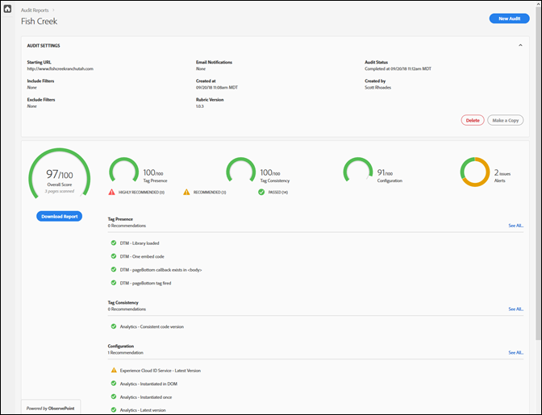

# 快速入門{#getting-started}

## 快速入門 {#task-1024e94b5948413295c9698e62165a04}

<!--
This page is a placeholder for now, we need things like prerequisites, any planning that should be done before using Auditor, initial setup info--that kind of thing.
-->

第一次使用 Auditor 時，您必須完成並接受 Auditor 合約。Auditor 是 Adobe 與 ObservePoint 共同開發的工具。Auditor 使用者可使用有限的 ObservePoint 功能，不需額外付費。若要使用 Auditor，您必須選擇加入 ObservePoint 的通訊。

## 執行您的第一次掃描{#task-b211597afed343cfa238443fcf7c6041}

1. 按一下 Adobe Experience Cloud 導覽列右上角的功能表按鈕，然後按一下&#x200B;**[!UICONTROL 「啟用」]**。

   

1. 選取 Auditor，並接受使用條款。

   Auditor 頁面會為您提供舊有掃描的控制面板，以及執行新掃描的選項。

   

1. 按一下&#x200B;**[!UICONTROL 「新增稽核」]**。

   若要執行新的掃描，請按一下畫面右上角的&#x200B;**[!UICONTROL 「新增稽核」]**。

   

1. 設定掃描。

   為稽核命名、提供起始 URL，然後按一下&#x200B;**[!UICONTROL 「執行報表」]**。完成掃描後，您會收到電子郵件通知。

   

   如需所有設定選項的說明，請參閱[建立新的稽核](../create-audit/create-new-audit.md#task-6d157f80e5264642b877c2820b1d077d)。
1. 檢視您的報表。

   當您收到電子郵件得知掃描已完成時，請按一下連結以[檢視您的報表](../reports/scorecard.md#concept-8958a64346c34f74844553dda1ccf869)，以開始瞭解有哪些機會可改善您的實施，並且讓 Adobe 解決方案發揮更大的效益。

   您也可以在 [Auditor](../get-started/audit-list.md) 頁面中按一下稽核的名稱，以查看稽核的狀態，並查看稽核完成後的報表。

   
