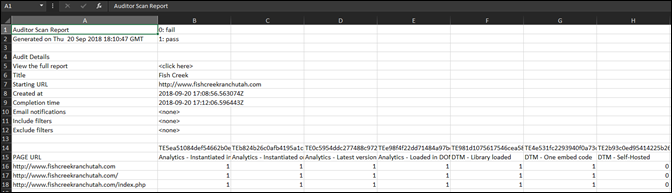

# 下載報表{#download-report}

報表會顯示各個 URL 是否通過。

您可以在使用者介面的「記分卡」頁面上檢視報表。您也可以下載報表：

1. 按一下 Adobe Experience Platform Auditor 清單或記分卡中的&#x200B;**[!UICONTROL 「下載報表」]**。

   您可以下載試算表或 PDF 檔案格式的報表。
1. 指定是否要開啟或儲存檔案。

1. 按一下&#x200B;**[!UICONTROL 「確定」]**。

   試算表會顯示每個頁面上的各項測試是否通過。

   

PDF 會顯示下列資訊：

* 稽核的設定
* 完成的時間戳記
* 整體分數
* 各類別的分數
* 套用失敗 URL 的單元測試
* 各項測試的建議與說明文件連結
