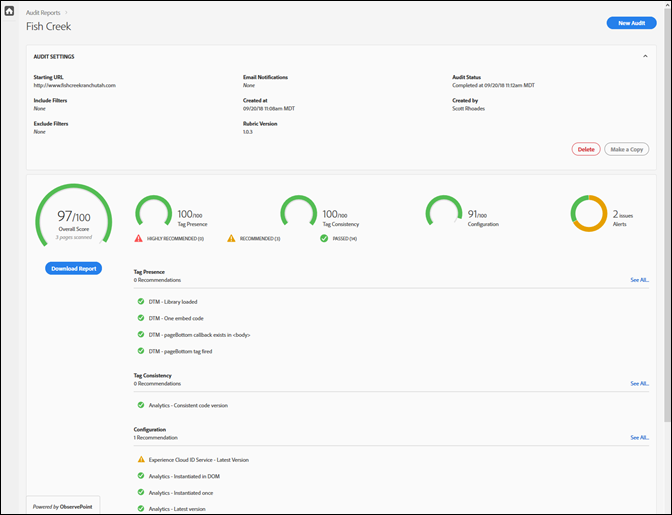
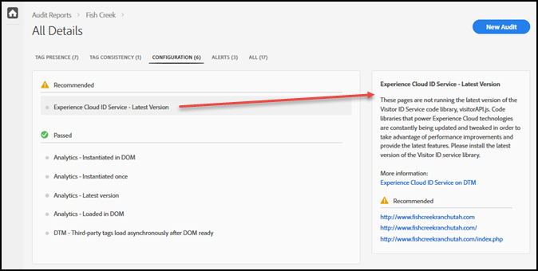

# 記分卡{#scorecard}

執行測試後，記分卡會顯示稽核的相關資訊。

在 Adobe Experience Platform Auditor 頁面上按一下稽核作業的名稱，即可檢視測試結果。

請使用記分卡查看稽核在以下類別的評分情形：

* 整體分數
* 標記是否存在

   評估標記是否存在，及其是否位於頁面代碼中的正確位置。
* 標記一致性

   評估各 URL 的標記是否一致。
* 設定

   根據其他規則和建議的最佳實務來評估標記。
* 警報

   警報會顯示您應留意但不影響分數的問題。

您的分數取決於每項測試的權重，以及您是否通過。如果通過，則分數會以等於測試權重的點數進行加權。

* 0：對您應留意、但不影響分數的問題提出警報。
* 1：建議最佳化。不影響資料正確性。
* 2：若未通過此測試，表示您將無法存取 Adobe Experience Cloud 中的最新功能和修正。
* 3：測試效率，以及實作是否遵循高度建議的最佳實務準則。
* 4：若未通過，表示您所收集的資料可能不可靠。
* 5：若未通過，表示可能會發生資料遺失。

記分卡會將任何 4 或 5 級的問題列為&#x200B;**強烈建議**&#x200B;您修正的問題。

記分卡會將任何 1 到 3 級的問題列為&#x200B;**建議**&#x200B;您修正的問題。

按&#x200B;**[!UICONTROL 「下載報表」]**&#x200B;即可下載內含稽核回報資訊的 [!DNL Excel] 或 PDF 檔案。

除了每個類別的分數以外，記分卡也會列出任何建議或強烈建議的修正，以及通過測試的項目。按一下個別問題，即可在右側的方塊中查看其他詳細資料。再按一下可進一步深入檢視，並查看修正問題的建議。以下顯示上述記分卡中「建議」問題的詳細資料：

按一下畫面頂端的類別，查看在每個類別中發現的問題。

## 哪些頁面是測試的一部分？{#section-fd38ffeb868648e89c34c5772fa65f46}

您可以檢視通過或未通過測試的 URL 清單。

在記分卡中按一下測試名稱，或按一下各個類別標題下的&#x200B;**[!UICONTROL 「查看全部」]**&#x200B;連結。這會將您導向至測試的詳細資料。對於各項測試，您可以查看測試說明，以及通過或未通過測試的完整 URL 清單。這項資訊也包含在下載的報表中。
